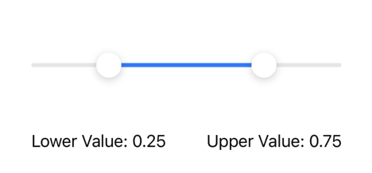

# RangeSlider



RangeSlider is a custom view in SwiftUI that allows the user to select a range of values by dragging two sliders. The project was built using Swift and SwiftUI.

## Installation

### Swift Package Manager

You can install RangeSlider using the Swift Package Manager. To install, add the following line to the dependencies section of your Package.swift file:

```
.package(url: "https://github.com/[username]/RangeSlider.git", from: "1.0.0")
Then, add RangeSlider to the dependencies array of your target:
```
```
.target(
    name: "MyTarget",
    dependencies: [
        "RangeSlider",
    ]
),
```

### CocoaPods

You can also install RangeSlider using CocoaPods. To install, add the following line to your Podfile:

```
pod 'RangeSlider', :git => 'https://github.com/[username]/RangeSlider.git', :tag => '1.0.0'
```
Then, run `pod install` to install the dependency.

### Manual Installation

To install and run this project locally, follow these steps:

1. Clone this repository to your local machine.
2. Copy the RangeSlider folder from the project to your own project.
3. Add the RangeSlider folder to your Xcode project.
4. Build and run the project.

## Usage

To use RangeSlider in your SwiftUI project, follow these steps:

1. Import the `RangeSlider` package in your SwiftUI view: `import RangeSlider`.
2. Create two `@State` variables to hold the lower and upper values of the range slider.
3. Add the `RangeSlider` view to your SwiftUI view, passing the `@State` variables to the lowerValue and upperValue parameters of the RangeSlider initializer.
4. The slider ranges between 0.0 and 1.0. There is a step parameter in the init which defaults to 0.01. This increments the slider so that as it moves along the path it goes 0.0, 0.01, 0.02 and so on. The step can be changed.

Here's an example:

```
import SwiftUI
import RangeSlider

struct ContentView: View {
    @State private var lowerValue = 0.2
    @State private var upperValue = 0.8
    
    var body: some View {
        VStack {
            Text("Lower Value: \(lowerValue, specifier: "%.2f")")
            Text("Upper Value: \(upperValue, specifier: "%.2f")")
            RangeSlider(lowerValue: $lowerValue, upperValue: $upperValue)
                .accentColor(.pink)
        }
    }
}
```
In this example, we're displaying the current values of the lower and upper values of the range slider using two Text views. We're also passing the @State variables lowerValue and upperValue to the RangeSlider view.

You can customize the colour of the slider by ussing the `.accentColor()` view modifier.

## Contributing

We welcome contributions to RangeSlider. To contribute, please follow these steps:

1. Fork this repository to your own GitHub account and clone it to your local machine.
2. Create a new branch for your feature: git checkout -b your-feature
3. Implement your feature and commit your changes: git commit -am 'Add new feature'
4. Push your changes to your fork: git push origin your-feature
5. Submit a pull request to the main branch of this repository.

Please ensure that your code adheres to our coding standards and that you have tested your changes thoroughly before submitting a pull request.

## Credits

This project was created and is maintained by Jack Vanderpump.

## License

RangeSlider is licensed under the MIT License.
